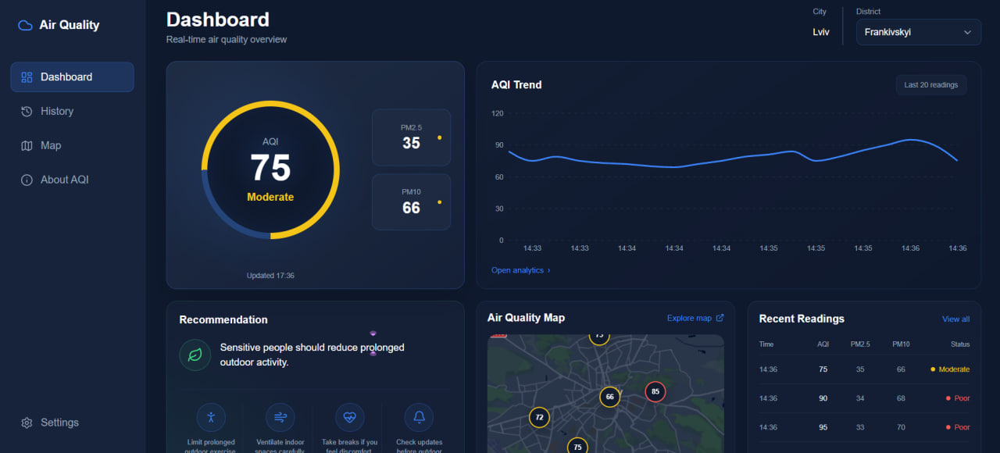
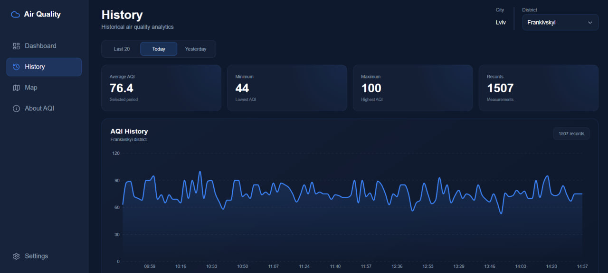
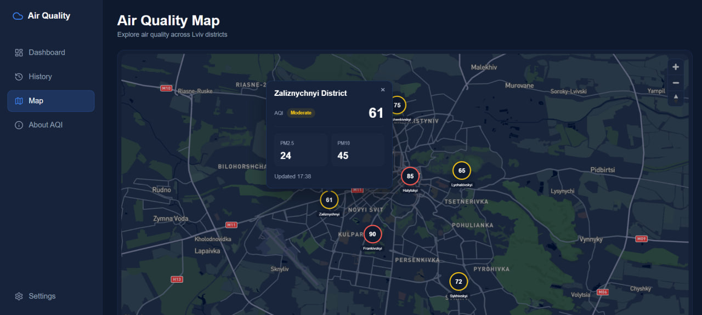
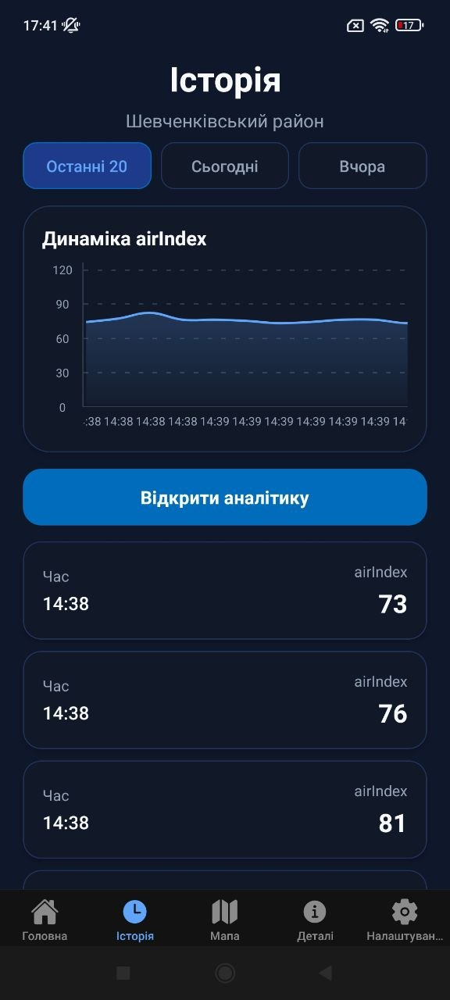

# Air Quality Monitoring System

A frontend-focused air quality monitoring system for visualizing current and historical air quality data across Lviv districts.

The project includes a responsive web dashboard built with React and TypeScript and a React Native mobile application built with Expo. Both clients provide interactive data visualization, district-based monitoring, maps, configurable alerts, theme support, and air quality recommendations.

Air quality measurements are generated by a simulator and updated every 10 seconds to reproduce a near-real-time monitoring workflow.

## Live Demo

**Web Application:** https://air-quality-monitoring-system-sigma.vercel.app/

## Preview

### Web Dashboard



### Historical Data & Map

<p>
  
  
</p>

### Mobile Application

<p align="center">
  
  
</p>

## Key Features

### Web Application

- Responsive dashboard built with React and TypeScript
- Near-real-time air quality monitoring for six Lviv districts
- Automatic data refresh every 10 seconds
- Historical data filtering by time range
- Interactive charts and air quality statistics
- Paginated historical measurements
- Interactive Mapbox map with district-level data
- Persisted district selection and user preferences
- Light, dark, and system theme support
- Browser push notifications with configurable alert thresholds
- Additional watched districts for notifications
- Accessible and reusable UI components
- Lazy-loaded application routes
- Optimized visualization of large historical datasets

### Mobile Application

- React Native application built with Expo and TypeScript
- Near-real-time and historical air quality data
- Interactive charts and analytics
- Mapbox-based district map
- Configurable push notifications
- User preferences persisted with AsyncStorage
- Optimized history rendering with `FlatList`

## Frontend Technologies

### Web

- React
- TypeScript
- Vite
- React Router
- SCSS
- Mapbox GL JS
- Recharts
- Web Push API
- Service Worker
- React Testing Library
- Vitest

### Mobile

- React Native
- Expo
- TypeScript
- Expo Router
- `@rnmapbox/maps`
- React Native Gifted Charts
- Expo Notifications
- AsyncStorage
- Jest

## Supporting Backend & Infrastructure

The project also includes a lightweight backend that supports both frontend clients.

- Node.js + Express REST API
- Turso / libSQL database
- Expo Push Service and Web Push
- Vercel for the web application
- Render for the backend API
- EAS Build for Android builds

## Architecture

The project follows a client-server architecture.

```text
Web Application / Mobile Application
               ↓
            REST API
               ↓
        Node.js + Express
               ↓
          Turso / libSQL
```

The web and mobile applications retrieve current and historical air quality data through the same REST API.

A simulator generates measurements for six Lviv districts, while the backend stores and serves the data to both clients.

## Testing & Code Quality

- **28 automated tests** across web, mobile, and backend
- 8 web tests using Vitest and React Testing Library
- 4 mobile tests using Jest and React Native Testing Library
- 16 backend tests using Jest and Supertest
- ESLint checks for web and mobile applications
- TypeScript-based web and mobile codebases
- Production build validation
- Accessibility improvements for interactive UI elements
- Environment-based configuration for API URLs and public client settings

## Project Structure

```text
air-quality-monitoring-system/
├── air-quality-web/      # React + TypeScript web application
├── air-quality-app/      # React Native + Expo mobile application
├── air-quality-server/   # Supporting REST API
├── docs/
│   └── screenshots/      # README preview images
└── README.md
```

## Getting Started

### Web Application

```bash
cd air-quality-web
npm install
npm run dev
```

Create a local `.env` file:

```env
VITE_API_URL=your_api_url
VITE_MAPBOX_TOKEN=your_mapbox_public_token
```

### Mobile Application

```bash
cd air-quality-app
npm install
npx expo start --dev-client
```

Create a local `.env` file:

```env
EXPO_PUBLIC_API_URL=your_api_url
EXPO_PUBLIC_MAPBOX_TOKEN=your_mapbox_public_token
```

The mobile application uses native Mapbox functionality, so local development requires an Expo development build rather than Expo Go.

The Android application also requires Firebase configuration through `google-services.json` for push notifications.

### Backend

```bash
cd air-quality-server
npm install
npm start
```

To generate simulated air quality measurements locally, run the simulator in a separate terminal:

```bash
node simulator.js
```

Backend configuration is provided through environment variables.

## Deployment

- **Web application:** Vercel
- **Backend API:** Render
- **Database:** Turso
- **Android builds:** EAS Build
